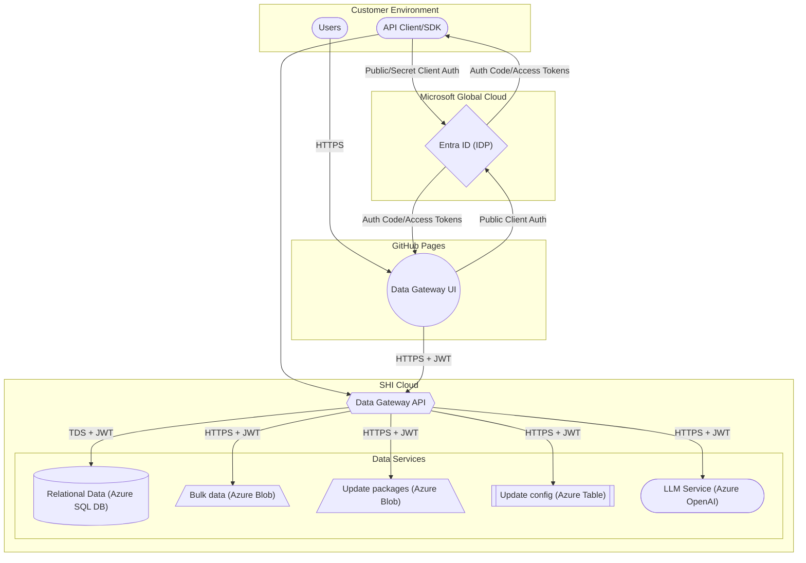
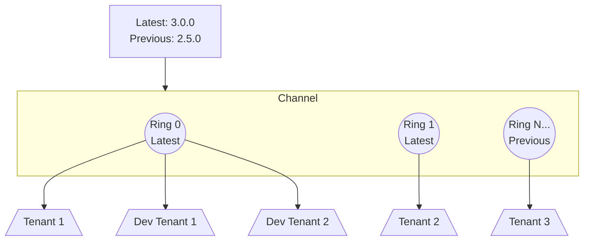
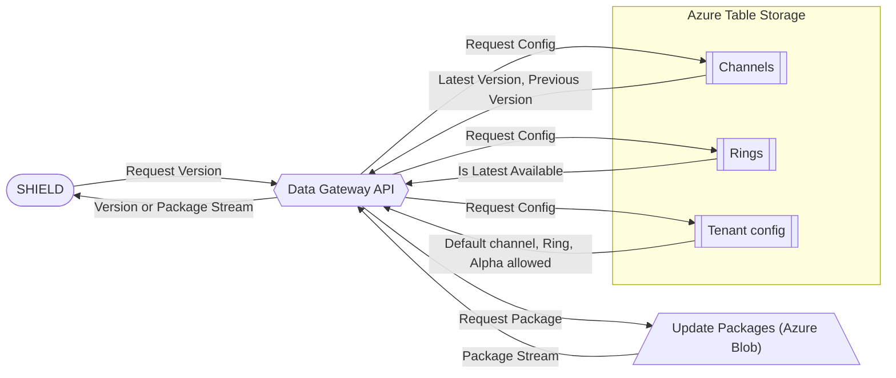

# Infrastructure

This page describes how Data Gateway is composed and how the core services interact within SHI Cloud.

---

## Platform topology

!!! note "Key points"
    - **Identity** - Entra ID is the only identity provider. The UI authenticates users and calls the API with bearer tokens.  
    - **Data access** - All reads/writes are brokered by the API:  
        - **Azure SQL Database** for processed relational data  
        - **Azure Blob Storage** for bulk reports and update packages  
        - **Azure Table Storage** for update service configuration  
    - **LicenseGPT** - Chat interactions are transient. Prompts are sent to the API and responses are returned in-session, never stored.

## SHIELD Update Service

Data Gateway controls update delivery using **channels** (e.g., stable, beta, alpha) and **rings** (e.g., ring 0, ring 1). Configuration is stored in **Azure Table Storage**; package files are stored in **Azure Blob Storage**.

### Example Channel Configuration

The below channel configuration demonstrates how the update system can be configured where various tenants are assigned by default to a ring in a channel.
The tenant's default channel can be overridden by API call. If this happens it defaults to ring 0 on the other channel.
In the below diagram, the channel is not named, all channels follow the below architecture.
There can be an unlimited number of rings in a channel. `N...` represents all numbers above 1.

The Alpha channel is RBAC gated and is not available by default. SHI has to approve Alpha access per-tenant.

### Data Flow

The below chart demonstrates how the data storage systems relate to each other and how the configurations flow to Data Gateway.

### Update Selection Process  

1. Tenant defaults define which channel and ring are used, and whether alpha builds are allowed.  
2. If you explicitly request a channel and it's permitted, the API applies it; otherwise the tenant default applies.  
3. The ring setting (latest or previous) determines the version within that channel.  
4. The API returns the resolved version and streams the corresponding package from Blob Storage.

### Data Flow Lifecycle

1. **Authenticate** - The UI authenticates with Entra ID and receives a token.  
2. **Authorize** - The UI calls the API over HTTPS with the JWT.  
3. **Process** - The API validates the token and performs reads/writes against SQL, Blob, or Table Storage.  
4. **Respond** - The API returns data or confirmation.  
5. **Render** - The UI presents the result to the user. *(LicenseGPT chat is not stored.)*

### Security and Reliability

- **Identity** - Entra ID is the single identity provider.  
- **Transport** - All calls use HTTPS.  
- **Isolation** - Clients never access data stores directly; all access is via the API.  
- **Controlled rollout** - Channels and rings enable predictable, staged updates.  
- **Resilience** - Operations are designed to handle transient faults.

### Component Map

| Component           | Backing service(s)              | Role                                                                 |
|---------------------|---------------------------------|----------------------------------------------------------------------|
| Data Gateway UI     | Web Browser, [GitHub Pages](https://docs.github.com/en/pages) | Entry point for user interactions (Tenant Manager, LicenseGPT)       |
| Data Gateway API    | HTTPS, [Entra ID auth](https://learn.microsoft.com/en-us/entra/identity-platform/application-model#multitenant-apps)            | Authenticates tokens and brokers access to data stores               |
| Processed Data      | [Azure SQL Database](https://learn.microsoft.com/en-us/azure/azure-sql/database)              | Relational/reporting data; tenant metadata                           |
| Bulk report Data    | [Azure Blob Storage](https://learn.microsoft.com/en-us/azure/storage/blobs/)              | JSON/report payloads                                                 |
| Update Packages     | [Azure Blob Storage](https://learn.microsoft.com/en-us/azure/storage/blobs/)              | Versioned package archives                                           |
| Update Config       | [Azure Table Storage](https://learn.microsoft.com/en-us/azure/storage/tables/)             | Channels, rings, and tenant update settings                          |
| LicenseGPT          | [Azure OpenAI Services](https://learn.microsoft.com/en-us/azure/ai-foundry/openai/overview)           | Provides LLM and Embeddings to the Data Gateway service              |

## See also

- [Usage Guide](../Usage-Guide/index.md)  
- [Threat Model](../assets/threat-models/Data-Gateway.tm7)  
- [API Reference](https://specs.shilab.com)
