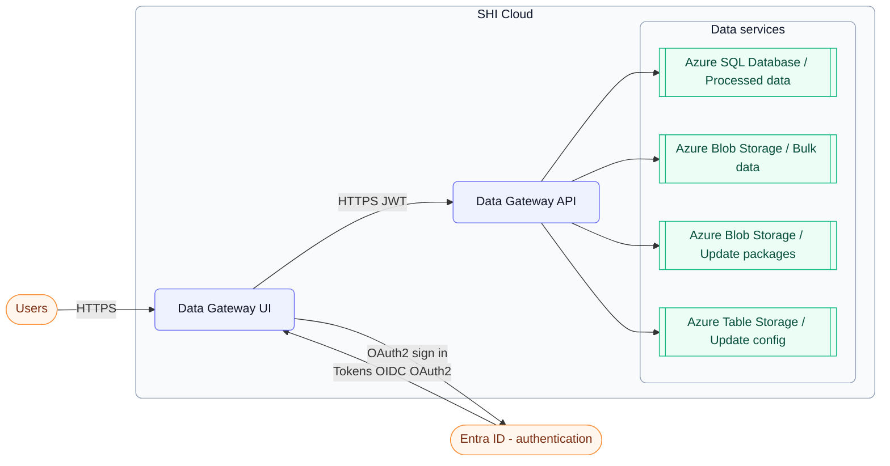
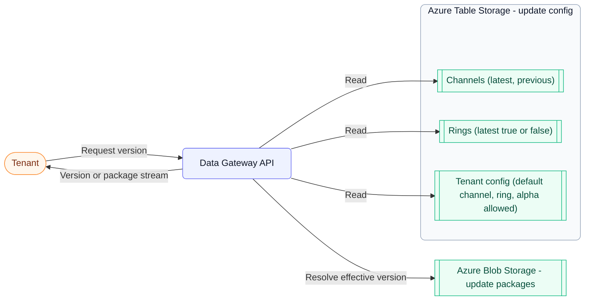

# Infrastructure

This page describes how Data Gateway is composed and how the core services interact within SHI Cloud.

---

## Platform topology

!!! note "Key points"
    - **Identity** - Entra ID is the only identity provider. The UI authenticates users and calls the API with bearer tokens.  
    - **Data access** - All reads/writes are brokered by the API:  
        - **Azure SQL Database** for processed relational data  
        - **Azure Blob Storage** for bulk reports and update packages  
        - **Azure Table Storage** for update service configuration  
    - **LicenseGPT** - Chat interactions are transient. Prompts are sent to the API and responses are returned in-session, never stored.

## Update service (channels & rings)

Data Gateway controls update delivery using **channels** (e.g., stable, beta, alpha) and **rings** (e.g., ring 0, ring 1). Configuration is stored in **Azure Table Storage**; package files are stored in **Azure Blob Storage**.

**Update selection process**  

1. Tenant defaults define which channel and ring are used, and whether alpha builds are allowed.  
2. If you explicitly request a channel and it’s permitted, the API applies it; otherwise the tenant default applies.  
3. The ring setting (latest or previous) determines the version within that channel.  
4. The API returns the resolved version and streams the corresponding package from Blob Storage.

## Data flow lifecycle

1. **Authenticate** - The UI authenticates with Entra ID and receives a token.  
2. **Authorize** - The UI calls the API over HTTPS with the JWT.  
3. **Process** - The API validates the token and performs reads/writes against SQL, Blob, or Table Storage.  
4. **Respond** - The API returns data or confirmation.  
5. **Render** - The UI presents the result to the user. *(LicenseGPT chat is not stored.)*

## Security and reliability

- **Identity** - Entra ID is the single identity provider.  
- **Transport** - All calls use HTTPS.  
- **Isolation** - Clients never access data stores directly; all access is via the API.  
- **Controlled rollout** - Channels and rings enable predictable, staged updates.  
- **Resilience** - Operations are designed to handle transient faults.

## Component map

| Component            | Backing service(s)           | Role                                                                 |
|---------------------|-------------------------------|----------------------------------------------------------------------|
| Data Gateway UI     | Web app (browser)             | Entry point for user interactions (Tenant Manager, LicenseGPT)       |
| Data Gateway API    | HTTPS, Entra ID auth          | Authenticates tokens and brokers access to data stores               |
| Processed data      | **Azure SQL Database**        | Relational/reporting data; tenant metadata                           |
| Bulk report data    | **Azure Blob Storage**        | JSON/report payloads                                                 |
| Update packages     | **Azure Blob Storage**        | Versioned package archives                                           |
| Update config       | **Azure Table Storage**       | Channels, rings, and tenant update settings                          |

## See also

- [Usage Guide](../Usage-Guide/index.md)  
- [Threat Model](../assets/threat-models/Data-Gateway.tm7)  
- [API Reference](https://specs.shilab.com)
