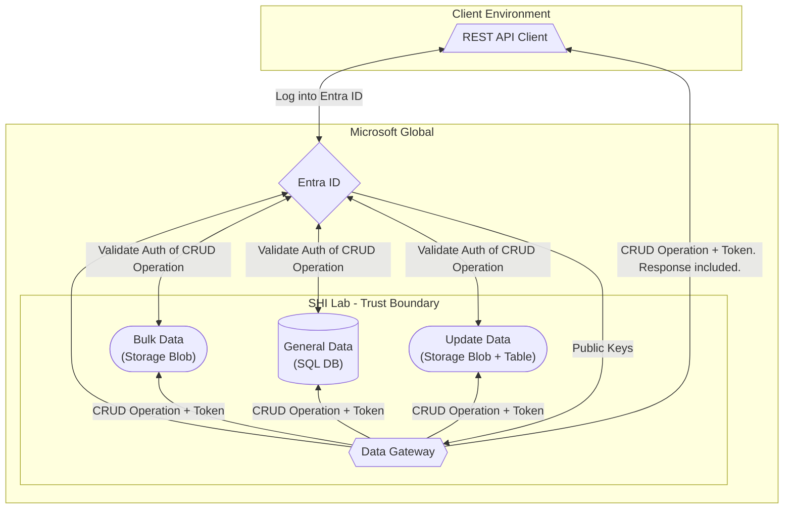

# Infrastructure Diagram

The below is the logical infrastructure interaction of the core Discover engine.
Each plugin interacts with the specific service configuration that is being interpreted.

## Diagram

## Threat Model

For an annotated threat model of the application's infrastructure architecture, please see the attached Microsoft [Threat Model Tool](https://aka.ms/tmt) representation of the infrastructure architecture.

📄 [Data Gateway - Threat Model](../assets/threat-models/Data-Gateway.tm7)
