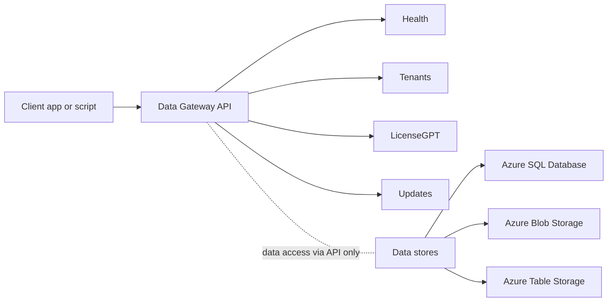

# Reference

This page is a hub for the **Data Gateway** reference material: how to authenticate, where to find the live API documentation, and a quick tour of the most-used endpoint families.

## Quick links

<div class="grid cards" markdown>

- :rocket: **Getting Started**  
  Sign in, navigate the UI, and complete common tasks.  
  [:octicons-arrow-right-24: Usage Guide](../Usage-Guide/index.md)

- :triangular_ruler: **Architecture**  
  Trust boundaries, components, and service interactions.  
  [:octicons-arrow-right-24: Infrastructure](../Architecture/Infrastructure.md)

- :gear: **API Reference (Swagger)**  
  Browse the live OpenAPI reference and try requests in your browser.  
  [:octicons-link-24: specs.shilab.com](https://specs.shilab.com)

</div>

## Authentication

Data Gateway uses **Entra ID** (Microsoft identity platform) for authentication.  
All requests must include a valid **OAuth 2.0 access token** in the `Authorization` header.

**Steps**

1. Sign in with your organization’s Entra ID account to obtain an access token for the Data Gateway application.  
2. Include the token in each API request:

```bash
curl -sS https://api.shilab.com/datagateway/status \
  -H "Authorization: Bearer <token>" \
  -H "Accept: application/json"
```

**Notes**
- Tokens are validated by the API; users do **not** access SQL or Storage directly.
- Tokens expire; refresh them using your chosen OAuth flow (authorization code, client credentials, etc.).  
- LicenseGPT prompts and responses are **not persisted** - the API returns results to the UI for the current session.


## Endpoint families (overview)

| Family | Purpose | Typical methods | Common paths* |
|---|---|---|---|
| **Health & metadata** | Service liveness and basic info | `GET` | `/status` |
| **Tenants** | Read and maintain tenant metadata (display name, parent association) | `GET`, `PATCH` | `/tenant`, `/tenant/{tenantId}` |
| **LicenseGPT** | AI-assisted licensing & compliance analysis | `POST` | `/chat/licenseGpt` |
| **Updates (channels & rings)** | Resolve version and retrieve update package | `GET` (and streaming) | See Swagger (“Updates”) |

\* For the complete, authoritative list (parameters, schemas, and responses), use the live reference at **[specs.shilab.com](https://specs.shilab.com)**.

## Request & response basics

- **Protocol:** HTTPS only  
- **Content type:** `application/json; charset=utf-8` (unless explicitly streaming binaries)  
- **Date/time:** ISO 8601 in UTC unless stated otherwise  
- **Pagination/filters:** When applicable, filter and paging parameters are documented per endpoint in Swagger

## Error handling

The API uses standard HTTP status codes with JSON error payloads.

| Code | Meaning |
|---|---|
| `200–299` | Success |
| `400` | Validation or malformed request |
| `401` | Missing/invalid token |
| `403` | Authenticated but not authorized |
| `404` | Resource not found |
| `409` | Conflict (e.g., invalid state for requested change) |
| `5xx` | Service error |

> The response body typically includes an explanatory message; consult Swagger for exact schemas.

## Visual map



---

## See also

- [Usage Guide](../Usage-Guide/index.md)  
- [Infrastructure](../Architecture/Infrastructure.md)  
- [API Reference (Swagger)](https://specs.shilab.com)
