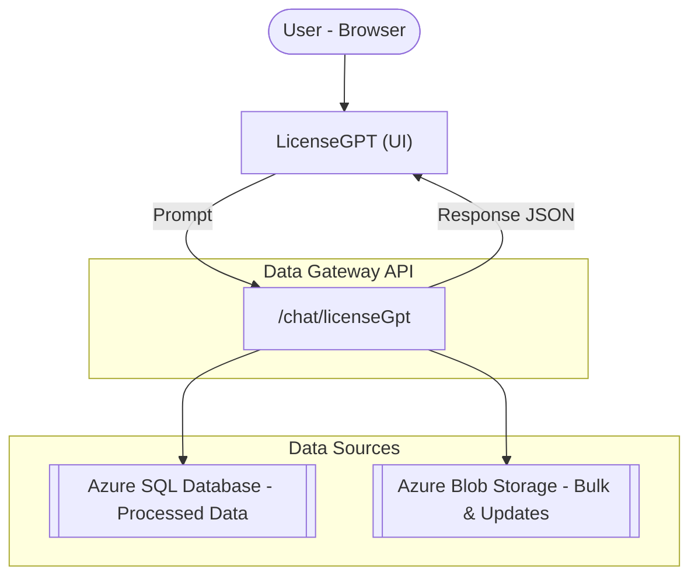
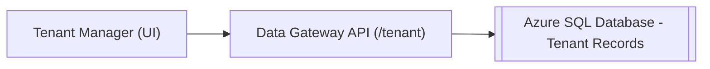

# Usage Guide

The Data Gateway provides a unified interface for tenant and product data across SHI Cloud.  
This guide describes the available modules, what they do, and how they map to backend services.

---

## Overview

With Data Gateway you can:

- Run AI-assisted queries on licensing and compliance data
- Manage tenant metadata (rename, associate, disassociate)
- Retrieve processed relational data from **Azure SQL Database**
- Access bulk reports and update package data in **Azure Blob Storage**
- Automate these operations through the **public API**

---

## Features

### LicenseGPT

- Conversational interface for licensing and compliance analysis
- Uses the API endpoint `POST /chat/licenseGpt`
- Combines data from **Azure SQL Database** (processed relational data) and **Azure Blob Storage** (bulk + update packages)
- Can surface **agentic actions**, such as:  
        - Retrieve License Report  
        - Get Correlation IDs
- Designed for compliance validation and license usage insights without writing queries

!!! info "Use case"
    LicenseGPT allows teams to validate license compliance without writing queries or exporting raw data.  
    It reduces manual effort by providing natural-language answers and direct report retrieval, ensuring faster insights for audits and optimization.

---

### Tenant Manager

- Displays tenant metadata: **Tenant ID**, **Display Name**, **Parent association**
- Supports three operations:
    - **Rename** → PATCH `/tenant/{id}` to update the display name
    - **Associate** → PATCH `/tenant/{id}` to set a parent tenant ID
    - **Disassociate** → PATCH `/tenant/{id}` to clear the parent reference
- All operations persist to the backend database and are reflected in downstream reporting

!!! info "Use case"
    Tenant Manager ensures tenant data remains consistent and structured across SHI Cloud.  
    By maintaining correct naming and parent relationships, organizations avoid reporting errors and ensure accurate compliance analysis.

---

## API Access

For automation and integration, use the **public OpenAPI specification**:

- **API Reference:** <https://specs.shilab.com>

Key endpoints:

- `POST /chat/licenseGpt` - AI-assisted licensing queries
- `GET /tenant` - retrieve tenant metadata
- `PATCH /tenant/{tenantId}` - rename, associate, or disassociate tenants
- Endpoints for bulk report retrieval and update package resolution (see Swagger)
- `GET /status` - health check

All requests require authentication with **Entra ID tokens** passed as HTTPS bearer tokens.

---

## Related Pages

- [Architecture Overview](../Architecture/index.md)  
- [Troubleshooting](../Troubleshooting.md)  
- [API Reference](https://specs.shilab.com)
