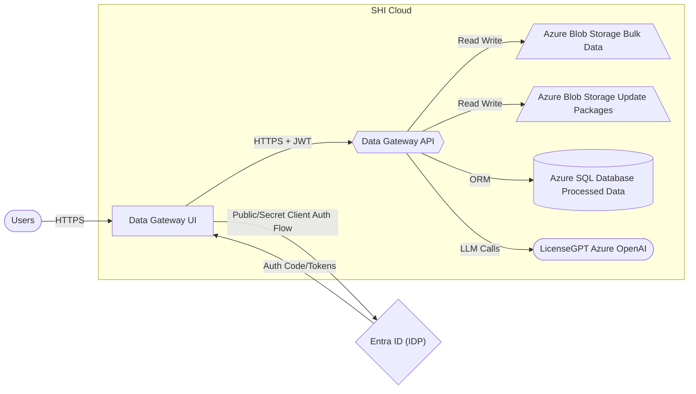

# SHI - Data Gateway

Data Gateway is SHI's secure data layer that unifies access to product and tenant information across SHI solutions.  
It provides a single, trusted path for ingesting, storing, and retrieving the data that powers SHIELD and related services.

!!! tip "Who should read this?"
    Admins, operators, and analysts who will use the Data Gateway UI or connect via the public API.

---

## What you can do

Data Gateway helps you:

- **Use the web UI** to explore tenant data and SHI experiences such as **Tenant Manager** and **LicenseGPT**.
- **Integrate via API** with SHI's services using the public OpenAPI/Swagger specification.
- **Authenticate securely** with your organization's Entra ID account to protect data access.
- **Ingest and retrieve reports** including license reports, entitlement data, and telemetry.
- **Manage updates** such as update packages and configuration channels stored in Azure Blob Storage.
- **Access processed relational data** in Azure SQL for compliance and reporting scenarios.

---

## Explore Data Gateway

- 🧭 **Getting Started**  
  Learn how to sign in, navigate the UI, and complete common tasks.  
  [:octicons-arrow-right-24: Usage Guide](./Usage-Guide/index.md)

- 🏗️ **Architecture**  
  Understand the service layout, trust boundaries, and how Data Gateway connects to SHI Cloud.  
  [:octicons-arrow-right-24: Architecture Overview](./Architecture/index.md)

- 🌐 **API Reference**  
  Browse the live API reference and try requests in your browser.  
  [:octicons-link-24: specs.shilab.com](https://specs.shilab.com)

---

## Architecture Overview

