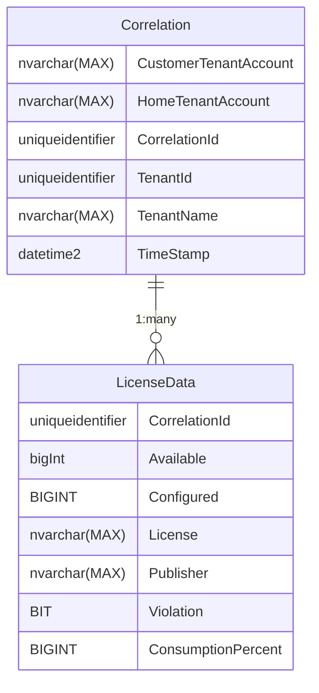

# Database Schema

The schema of the database is broken up into two parts, the `Correlation` table and the `License Data` table.

These tables can be named anything as MLA can be configured to use different names, which can be configured during deployment.

The Correlation table stores records of the runs the tool has completed.
One of these records will be generated per run and contains the login information, timestamp, correlation ID, and tenant metadata.

The License Data table stores the specific metadata for a single license. This includes data such as the count of used and available licenses as well as display names for the license and a correlation ID to link it to a run of the MLA tool.

All values will not be `null` in the DB. If a value can't be retrieved it will be set as 0 or false or the equivalent `null` state for the type of the column, not the `null` value. Please see the documentation for each [plugin](Plugins/index.md) to see what values are expected.

## Diagram

## Correlation Table Details

| Column Name | Type | Description |
| :---------: | :--: | :---------: |
| `AuditTenantAccount` | `nvarchar(MAX)` | The user principal name used to authenticate into the tenant being audited. |
| `ReportTenantAccount` | `nvarchar(MAX)` | The user principal name used to authenticate with to store the records in the Azure SQL Database. |
| `CorrelationId` | `uniqueidentifier` | Unique Identifier that represents a single run of the MLA tool. This Record is used to identify which license data records should be grouped together. |
| `TenantId` | `uniqueidentifier` | Tenant that the tool was run against. |
| `TenantName` | `nvarchar(MAX)` | Human friendly name of the tenant that the tool was run against. |
| `TimeStamp` | `datetime2` | Time at which the tool started executing, not when the tool finished. This is UTC time. |

## License Data Table Details

The Correlation ID key is related to the `Correlation Table`'s CorrelationID key.
There can be any number of records that are correlated to the specific run (Correlation) ID.

These records are generally created by the plugin responsible for the specific license.

| Column Name | Type | Description |
| :---------: | :--: | :---------: |
| `CorrelationId` | `uniqueidentifier` | Run ID of the specific record to correlate to a specific execution session. |
| `Available` | `BIGINT` | Count of available licenses across all purchased license types. |
| `Configured` | `BIGINT` | Count of licenses required for the specific service configuration. |
| `License` | `nvarchar(MAX)` | Human friendly display name of the license, to identify which license is being reported on with this record. |
| `Publisher` | `nvarchar(MAX)` | Human friendly owning name of the company that issues the license.
| `Violation` | `BIT` | Flag that indicates that more licenses are configured for use compared to what has been purchased. |
| `ConsumptionPercent` | `BIGINT` | Percentage that represents the total unique monthly active users for the specific license. This number is relative to the timestamp in the correlation record. |

## Relationships

Relationships are not coded into the table's schema. They are implemented in the MLA app's code, which means the SQL DB won't check the data provided exists when writing to the DB. This is because the schema is auto generated at runtime and the way it is generated is per table, with no visibility to other tables.

The code will enforce the relationships, the SQL server won't know they exist.

- The `CorrelationId` column in the `License Data` table is a one to many relationship with the `CorrelationId` column in the `Correlation` table.
    - This links the two tables together so that the license data table can have its records grouped together to identify data from the same runs and to reduce the amount of data that needs to be stored for each record by having the common data in the `Correlation` table.

## See Also

- [Plugins](Plugins/index.md)
- [Standard Installation](Deployment/Standard-Install.md)
