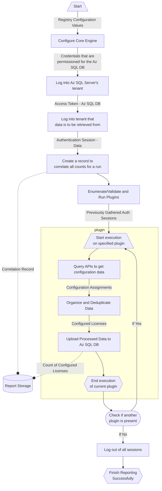

# Execution Flowchart

```mermaid
flowchart TD

AzSqlDb[("Report Storage")]

Start[/"Start"\]
Initialization["Configure Core Engine"]
LoginHost["Log into Az SQL Server's tenant"]
LoginCustomer["Log into tenant that\ndata is to be retrieved from"]
ReportCorelationRecord["Create a record to\ncorrelate all counts for a run"]
LoadPlugins["Enumerate/Validate and Run Plugins"]

subgraph plugin
StartPlugin[/"Start execution\non specified plugin"\]
GetData["Query APIs to get configuration data"]
ProcessData["Organize and Deduplicate Data"]
ReportProcessedData["Upload Processed Data to Az SQL DB"]
EndPlugin{{"End execution\nof current plugin"}}
end

LoopPlugin(["Check if another\nplugin is present"])
LogOut["Log out of all sessions"]
SuccessEnd{{"Finish Reporting\nSuccessfully"}}

Start -->| Registry Configuration Values | Initialization
Initialization --> | Credentials that are\npermissioned for the Az SQL DB| LoginHost
LoginHost --> | Access Token - Az SQL DB | LoginCustomer
LoginCustomer --> | Authentication Session - Data | ReportCorelationRecord
ReportCorelationRecord -.-o | Correlation Record | AzSqlDb
ReportCorelationRecord --> LoadPlugins
LoadPlugins --> | Previously Gathered Auth Sessions | StartPlugin
StartPlugin --> GetData
GetData --> | Configuration Assignments | ProcessData
ProcessData --> | Configured Licenses | ReportProcessedData
ReportProcessedData -.-o | Count of Configured Licenses | AzSqlDb
ReportProcessedData --> EndPlugin
EndPlugin --> LoopPlugin
LoopPlugin --> | If Yes | StartPlugin
LoopPlugin --> | If No | LogOut
LogOut --> SuccessEnd
```
