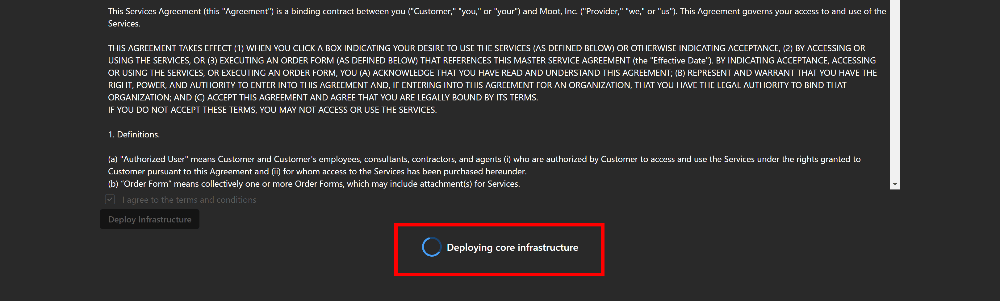

# Usage Guide

The Deploy module in SHIELD provides a self-service interface to manage the infrastructure deployed under the SPA framework. Once the initial setup is complete, this guide walks through how to manage core configuration objects using the SHIELD UI.

---

## Managing Infrastructure with SHIELD

After core deployment is complete, the Deploy module allows you to:

- View and validate infrastructure components
- Create and manage scoped security groups
- Manage Entra ID Administrative Units
- Assign configuration profiles and scope tags
- Monitor deployment status and lifecycle metadata

These actions are performed through the **Lifecycle Infrastructure** interface on the SHIELD home screen.

---

## Defender for Endpoint Workspace Creation

SHIELD relies on Microsoft Defender for Endpoint to enforce protections on devices within the Privileged Access Boundary. Before deploying Conditional Access policies or tagging devices, Defender must be initialized.

### How to Check Workspace Status

1. Go to [Microsoft 365 Defender](https://security.microsoft.com){:target="_blank"}.
2. Navigate to **Devices** in the left menu.
3. If a device list appears, the workspace is already created.
4. If you see a splash screen indicating setup, wait until it completes.

Once initialized, Defender for Endpoint will automatically integrate with SHIELD's lifecycle and tagging logic.

---

## Lifecycle Actions Enabled by Deploy

The infrastructure deployed by this module supports:

- Device class-based lifecycle enforcement (Enterprise, Specialized, Privileged)
- Dynamic user and device scoping based on conditional access policies
- Tagging systems to trigger automated controls via Intune and Entra ID

All these features are available via the SHIELD UI, and are configured automatically based on security class and role mappings.

---

## Visual Walkthrough

Once core deployment is complete, your SHIELD UI will provide management cards for:

- **Deploy Core Infrastructure** (initial setup)
- **Manage Infrastructure** (view/edit configs)
- **Lifecycle Device Management** (commission, assign, unassign)
- **Lifecycle User Management** (create, remove, assign roles)

### Deploy Core Infrastructure UI Flow

#### 1. Deploy Button with Checkbox Confirmation

{ loading=lazy }

#### 2. Deployment in Progress

{ loading=lazy }

#### 3. Completion Redirect – SHIELD Home Screen

{ loading=lazy }
{ loading=lazy }

!!! info "Automation Note"
    SHIELD manages all object relationships behind the scenes (e.g., group assignments, RBAC links, tag application). You only need to select the correct class and object — SHIELD handles the rest.

---

## Related Pages

- [Deploy Overview](index.md)
- [Deployment Guide](../Getting-Started.md)
- [Reference Docs](Reference/index.md)
- [Troubleshooting](Troubleshooting.md)