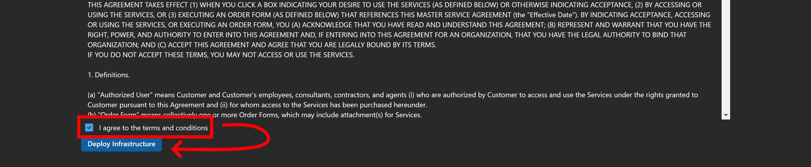

# Deploy Core Infrastructure

You have to meet the prerequisites before being able to deploy the core infrastructure.
The core infrastructure is where the main configurations reside for the SHIELD product.
Once this is deployed, the configurations can be customized and the lifecycle management system can be used.

After deployment, the only parts of the core infrastructure that can't be touched are the `security groups`, `Intune scope tags` and `Entra ID Administrative Units`. All other items can be modified, including the device configurations, autopilot profiles and conditional access.

!!! note "Prerequisites Check"
    Don't forget to make sure you meet the prerequisites as listed here:
    [Getting Started - Prerequisites](../Prerequisites.md)

---

## Deployment

After the pre-requisites are met, you can deploy the core infrastructure.
Deploying the core-infrastructure is pretty easy:

1. Open the SHI Orchestration Platform app to the URL that you deployed to. It will open itself to the `Infrastructure Deployment` page.

    !!! note "Portal Location"
        By default, this is a subdomain at `{your-company}.azurewebsites.net`

2. Read the `Terms and Conditions` document and if you agree, select the `I agree to the terms and conditions` check box. This will enable and arm the `Deploy Infrastructure` button.

    { loading=lazy }

3. Push the `Deploy Infrastructure` button. This will deploy all the supporting components to the lifecycle management system.

    { loading=lazy }

4. Once the deployment has completed it will redirect you to the home screen as seen in the below screenshot.

    { loading=lazy }
    { loading=lazy }
