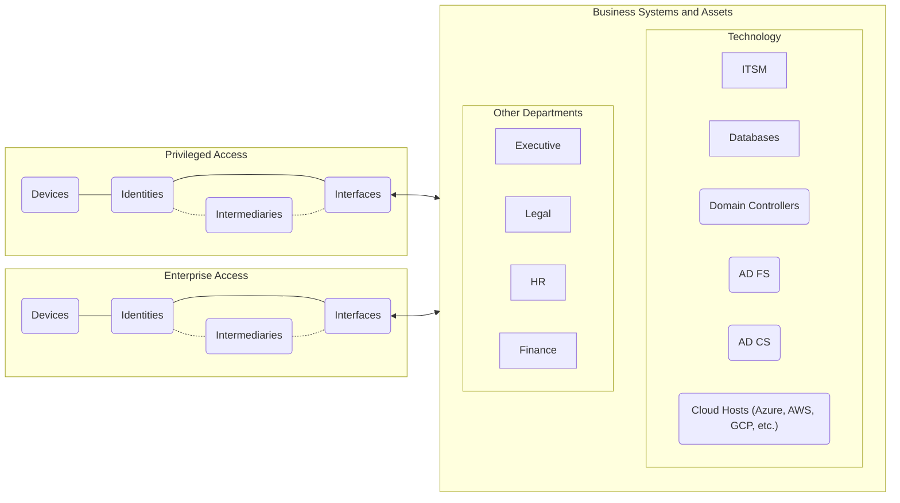

# Overview

SHIELD’s Deploy module provides the foundation for a secure environment using Microsoft’s **Securing Privileged Access (SPA)** architecture. This module automates the provisioning of security-critical components such as identity boundaries, privileged access zones, Conditional Access policies, and more.

The Deploy module ensures your environment is segmented appropriately and aligns with Microsoft’s Zero Trust principles by separating enterprise and privileged systems.

---

## What Is SPA?

Microsoft’s **Securing Privileged Access (SPA)** model is a layered defense framework designed to protect your most critical systems from identity compromise. SPA separates access tiers between everyday business operations and sensitive administrative functions.

The diagram below illustrates SPA’s architecture and how privileged vs enterprise identity flows interact with the environment.

---

## What Does Deploy Include?

The Deploy module provisions all infrastructure required to enforce this separation of trust boundaries, including:

- Tiered security groups
- Intune scope tags
- Entra ID administrative units
- Device onboarding and configuration profiles
- Conditional Access policies
- Role-based access control for privileged systems

These objects form the **Privileged Access Boundary** and are deployed via the SHIELD app in a few clicks.

---

## Why It Matters

By centralizing and automating the deployment of SPA, the Deploy module:

- Eliminates human error in policy setup
- Reduces deployment time from months to minutes
- Enables a repeatable, auditable security baseline
- Ensures identity boundaries are established before user/device onboarding

---

## Related Pages

- [Deployment Guide](../Deployment.md)
- [Deploy Usage Guide](Usage-Guide.md)
- [Deploy Reference](Reference.md)
- [Troubleshooting Deploy Module](Troubleshooting.md)

