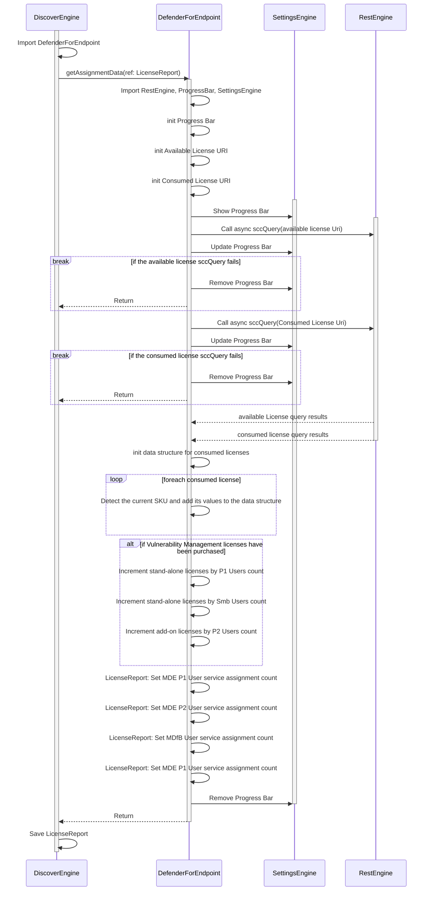

# Defender for Endpoint

When interpreting the MDE plugin's results in the `License Data` table, a result that has a 0 count of available licenses could mean that no license is present even if a record is present that represents the license.
This is because the license data is coming from MDE and not the licensing system. We do this because MDE could be enabled without a corresponding license. E.g. Defender for Cloud for Servers.

## Licenses Checked

Please note that due to the way Microsoft makes this data available, the license report format uses the mappings found in the [Reserved Principals](../Reference/Reserved-Principals.md) page.

- Defender for Business (SMB) - `bfc1bbd9-981b-4f71-9b82-17c35fd0e2a4`
- Defender for Endpoint P1 - `292cc034-7b7c-4950-aaf5-943befd3f1d4`
- Defender for Endpoint P2 - `871d91ec-ec1a-452b-a83f-bd76c7d770ef`
- Defender Vulnerability Management Standalone - `36810a13-b903-490a-aa45-afbeb7540832`
- Defender Vulnerability Management Addon - `36810a13-b903-490a-aa45-afbeb7540832`

## Permissions/Roles Required

- [X] Global Reader
    - Count of active users and devices
- [X] Security Administrator
    - Count of available licenses

## Execution Sequence

The following diagram shows the plugin execution Sequence.

## Diagram

