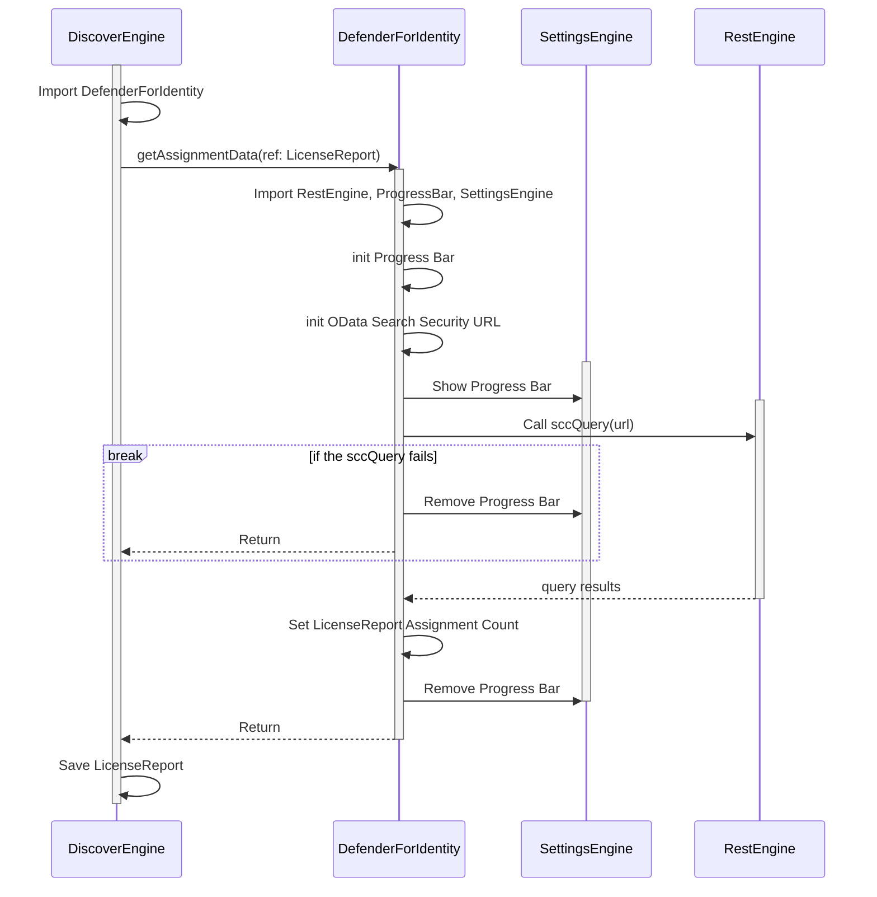

# Defender for Identity

Defender for Identity (MDI) is evaluated by the total **possible** count of users monitored by MDI, not the count of users in the tenant.

Other types of principals such as devices and groups are ignored.

!!! warning "License Overage Calculation"
    Due to how MDI is licensed, you will need to subtract the total count of **service accounts** and any **duplicate user accounts** (where only one account per human is counted) from the number of configured licenses that Discover reports.

    ---

    - Example 1: `Human 1` has two accounts, `user 1` and `user 2`. Discover will see two accounts, since they are both for the same human, you will need to subtract 1 from the total.
    - Example 2: `Human 1` has two service accounts, `service 1` and `service 2` and a user account, `user 1`. Discover will see 3 accounts. Since service accounts are free, subtract 2 from the total.

## Licenses Checked

Please note that due to the way Microsoft makes this data available, the license report format uses the mappings found in the [Reserved Principals](../Reference/Reserved-Principals.md) page.

- Defender for Identity - `14ab5db5-e6c4-4b20-b4bc-13e36fd2227f`

## Permissions/Roles Required

- [X] Global Reader
    - Count of available licenses
- [X] Security Administrator
    - Count of users being protected

## Execution Sequence

The following diagram shows the plugin execution Sequence.

## Diagram

