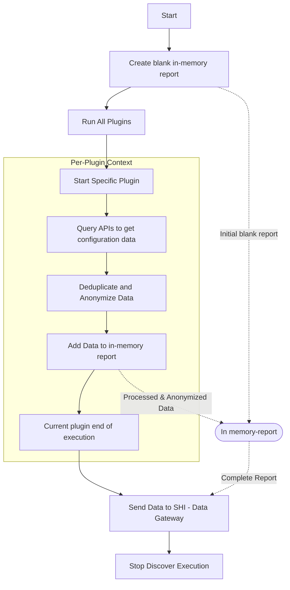

# Execution Flowchart

The following diagram shows the plugin execution flow from engine startup through plugin enumeration, execution, and data upload.

## Diagram

```mermaid
flowchart TD
start["Start"]
createBlankReport["Create blank in-memory report"]
reportMemoryReference(["In memory-report"])
runPlugins["Run All Plugins"]

subgraph pluginContext["Per-Plugin Context"]
    pluginStart["Start Specific Plugin"]
    queryData["Query APIs to get configuration data"]
    annonDedupe["Deduplicate and Anonymize Data"]
    addData["Add Data to in-memory report"]
    stopPlugin["Current plugin end of execution"]
end

uploadData["Send Data to SHI - Data Gateway"]
stopExection["Stop Discover Execution"]

start --> createBlankReport
createBlankReport -. Initial blank report .-> reportMemoryReference
pluginStart --> queryData
queryData --> annonDedupe
annonDedupe --> addData
addData -. Processed & Anonymized Data .-> reportMemoryReference
createBlankReport --> runPlugins
runPlugins --> pluginStart
addData --> stopPlugin
stopPlugin --> uploadData
reportMemoryReference -. Complete Report .-> uploadData
uploadData --> stopExection
```
