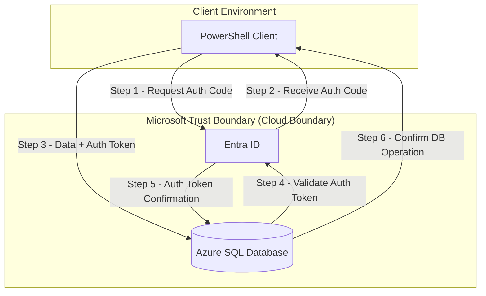
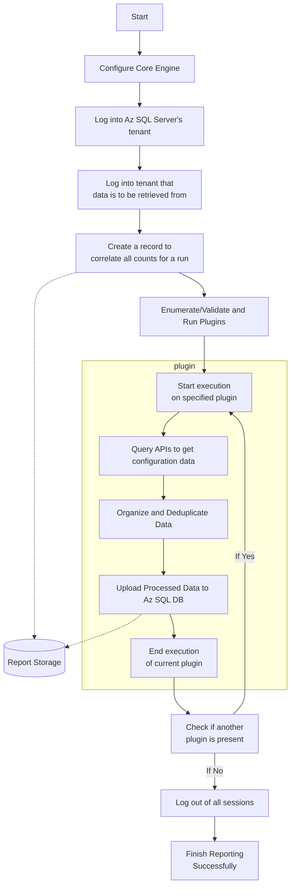

# Overview

The Discover module enables advanced licensing intelligence and compliance reporting for Microsoft 365 services. It retrieves configuration data from multiple service APIs, analyzes it, and stores compliance results in an Azure SQL database for visualization in tools like Power BI.

Discover is plugin-driven, lightweight, and runs entirely from the client environment via PowerShell.

---

## What Discover Does

- Retrieves Microsoft service configuration data using Graph API and Defender APIs
- Evaluates license assignments against usage and configuration
- Stores structured results in an Azure SQL database
- Visualizes data using third-party tools such as Power BI

Discover allows organizations to:

- Ensure license assignments match technical requirements
- Detect gaps in purchased vs. configured capabilities
- Automate configuration audits across tenants

---

## Plugin Architecture

Discover’s core engine is extensible through plugins. Each plugin is responsible for extracting and evaluating configuration from a specific service:

- 🔌 **Entra ID Plugin** – Retrieves directory and user-level settings
- 🔌 **Defender for Endpoint Plugin** – Retrieves configuration and licensing status
- 🔌 **Defender for Identity Plugin** – Extracts rules and signals used in audit logic

Plugins are executed sequentially, and their results are normalized before being uploaded to the Azure SQL Database.

📖 See full list in [Reference → Plugin Overview](Reference/index.md#plugin-overview)

---

## Infrastructure Architecture

The infrastructure diagram below shows how the Discover engine interacts with Microsoft services and securely stores results in Azure SQL:

### Infrastructure Flow

📄 Download annotated threat model: [Infrastructure Threat Model (.tm7)](assets/threat-models/infrastructure.tm7)

---

## Execution Process

The following diagram shows the plugin execution flow from engine startup through plugin enumeration, execution, and data upload.

### Execution Flowchart

---

## Related Pages

- [Discover Deployment](Deployment/index.md)
- [Discover Usage Guide](Usage-Guide.md)
- [Discover Reference](Reference/index.md)
- [Troubleshooting Discover](Troubleshooting.md)

# Overview

The Discover module enables advanced licensing intelligence and compliance reporting for Microsoft 365 services. It retrieves configuration data from multiple service APIs, analyzes it, and stores compliance results in an Azure SQL database for visualization in tools like Power BI.

Discover is plugin-driven, lightweight, and runs entirely from the client environment via PowerShell.

---

## What Discover Does

- Retrieves Microsoft service configuration data using Graph API and Defender APIs
- Evaluates license assignments against usage and configuration
- Stores structured results in an Azure SQL database
- Visualizes data using third-party tools such as Power BI

Discover allows organizations to:

- Ensure license assignments match technical requirements
- Detect gaps in purchased vs. configured capabilities
- Automate configuration audits across tenants

---

## Plugin Architecture

Discover’s core engine is extensible through plugins. Each plugin is responsible for extracting and evaluating configuration from a specific service:

- 🔌 **Entra ID Plugin** – Retrieves directory and user-level settings
- 🔌 **Defender for Endpoint Plugin** – Retrieves configuration and licensing status
- 🔌 **Defender for Identity Plugin** – Extracts rules and signals used in audit logic

Plugins are executed sequentially, and their results are normalized before being uploaded to the Azure SQL Database.

📖 See full list in [Reference → Plugin Overview](Reference/index.md#plugin-overview)

---

## Infrastructure Architecture

The infrastructure diagram below shows how the Discover engine interacts with Microsoft services and securely stores results in Azure SQL:

### Infrastructure Flow

📄 Download annotated threat model: [Infrastructure Threat Model (.tm7)](assets/threat-models/infrastructure.tm7)

---

## Execution Process

The following diagram shows the plugin execution flow from engine startup through plugin enumeration, execution, and data upload.

### Execution Flowchart

---

## Related Pages

- [Discover Deployment](Deployment/index.md)
- [Discover Usage Guide](Usage-Guide.md)
- [Discover Reference](Reference/index.md)
- [Troubleshooting Discover](Troubleshooting.md)

