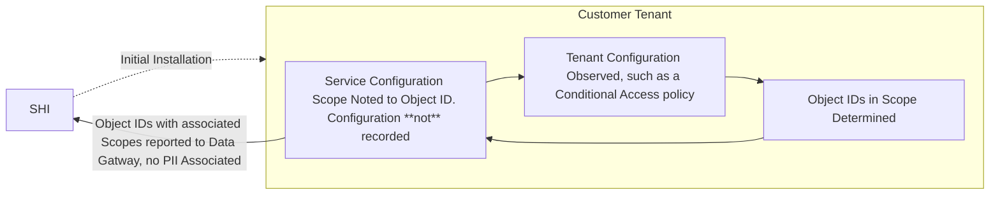

# Overview and Installation Requirements

!!! info "Security Considerations"
    While this application requires sensitive permissions to conduct the automated scan, by self-hosting the application, SHI does not represent a supply chain risk or path to compromise a customer environment via the SHIELD platform, as there is no control maintained beyond the initial point of installation. All code being run to conduct the automated discovery is available for code & security reviews prior to engagement upon request. Permissions exist for both the user initiating the report & the application itself. Code review is available upon request.

## Overview

This application is a self-hosted application that exists in the customer tenant on an Azure App Service, collecting and processing the requisite data only within the customer tenant before provided abstracted & fully anonymized data results back to SHI for reporting. All requirements can be set up by the delivery team or customer prior to engagement.

---

## Setup Steps/Requirements

### Using SHIELD - Desktop's Installer module

1. Create new Dedicated Azure Subscription.
2. Run the installer to set up SHIELD automatically.

---

### Deploying by hand

1. Create new Dedicated Azure Subscription.
2. Install PowerShell Dependencies
    - Latest [v7](https://learn.microsoft.com/en-us/powershell/scripting/install/installing-powershell){:target="_blank"} release installed (ideally from the [Microsoft Store](https://www.microsoft.com/store/productId/9MZ1SNWT0N5D){:target="_blank"})
    - Modules: [Az](https://www.powershellgallery.com/packages/Az){:target="_blank"}, [Microsoft.Graph.Beta](https://www.powershellgallery.com/packages/Microsoft.Graph.Beta){:target="_blank"}
    - Scripts: [Grant-MIGraphPermission](https://www.powershellgallery.com/packages/Grant-MIGraphPermission){:target="_blank"}
3. Create a new resource group named: `SHIELD`
4. Create a new Azure App Service (Web App)
    - OS: Linux
    - Minimum SKU: P0v4
    - Runtime Stack: Node 24 LTS
    - Azure Cost Estimate associated (as of 1/8/2025):

| Premium v4 Service Plan | vCPU(s) | RAM | Storage | Pay as you go | 1 year savings plan | 3 year savings plan | 1 year reserved | 3 year reserved |
|-----------------|-------------------|---------------------|-----------------|-------------------|---------------------|-----------------|-------------------|---------------------|
| P0v4 | 1 | 4 GB | 250 GB | **$86.870**/month | **$70.365**/month ~ 19% savings | **$58.203**/month ~ 33% savings | **$65.000**/month ~ 25% savings | **$53.831**/month ~ 38% savings |
| P1v4 | 2 | 8 GB | 250 GB | **$173.740**/month | **$140.730**/month ~ 19% savings | **$116.406**/month ~ 33% savings | **$130.086**/month ~ 25% savings | **$107.668**/month ~ 38% savings |

## Permissions

- The User logging in to SHIELD: Discover requires either Global Admin or the following:
    - Global Reader
    - Security Administrator
    - User Administrator
- **The service principal (System Assigned Managed identity is recommended) must be granted**:
    - `Owner` for the Azure Subscription assigned to app
    - `AppRoleAssignment.ReadWrite.All`
    - `Application.ReadWrite.All`
    - [Additional permissions](../Prerequisites/Required-Graph-API-Permissions.md) will be self-assigned by the app to save time and begin data collection.

### Networking

- Network Endpoints:
    - <https://api.shilab.com>
    - <https://url.shilab.com>
    - https://*.azurewebsites.net
- Disable network traffic inspection/unwrapping/decryption
    - According to [Microsoft Documentation](http://aka.ms/pnc){:target="_blank"}, Traffic Inspection of any kind via a tool like Palo, Zscaler, or nginx (caching) violates Microsoft's Terms & Conditions (as well as each major cloud provider) as traffic that was decrypted and is heading to Microsoft is indistinguishable from man in the middle attacks.
    - As a result, all traffic inspected is promptly dropped by Microsoft. As we rely on Azure Networking for SHIELD to run, this prevents SHIELD from functioning.
    - Please validate that **ALL** Microsoft traffic is excluded from any form of Network Inspection: this is a requirement for SHIELD to function, as it is against Microsoft's terms and conditions.

---

## Data Security

### SHI Lab Azure Architecture

- Regulatory compliance standards: [https://servicetrust.microsoft.com/](https://servicetrust.microsoft.com/){:target="_blank"}
- Encryption at rest (mandatory)
- Encryption in transit (mandatory)
    - Quantum resistant algorithms only
    - Latest TLS version for resource only
- CRUD Audit
    - SQL Audit is enabled too
- Access Audit (Mandatory)
- Full micro-segmentation (address/port enforcement for all resources)
- Data-store behind API, no internet access
- SSO Access Only (no cred vaulting workarounds, pure modern SSO, credential-less only)
- MFA for all authentication is mandatory
- Human-free production-only design
    - Access to the Production environment is limited to only highly critical incidents.
- Debug access is severely limited
- No Operating Systems
    - Pure Serverless
    - Always up to date
    - No custom execution except for designed workload (no viruses possible)
    - No update downtime
    - Vulnerability patching done before public announcement of vulnerability
    - Self-healing

### Miscellaneous Considerations

- No customer data is used in any environment except for production
- Environment is only production only, reducing surface area of attack
    - No dev or test environments
    - Prod only via ring deployment and feature flags
- All tooling can run locally so that no production access is required for testing, development and debugging
- No on-premise systems, all resources are cloud only including end user compute/systems
- Hardware supply chain is strictly enforced
- Surface devices are only allowed at all levels of end user compute
- Firmware credentials are set to cert auth on all endpoints
- Device source code available for review: [https://microsoft.github.io/mu/](https://microsoft.github.io/mu/){:target="_blank"}

---

## Data Structure

### High-level Data Flow Diagram

SHIELD: Discover does not collect PII or similar data – it is only focused on the scope of configurations within the Microsoft security stack, and not on any private employee or customer data. Specifics on what data collected is listed in the next section.
As a self-hosted application, data collected lives in the customer environment until it is anonymized and sent to SHIELD's database via the Data Gateway. The Data Gateway structure is available to review upon request.

### Example Data Structure & Output

SHIELD Discover collects the following data:

- Tenant ID
- Principal ID that saved the report
- Principal ID that ran the report
- Principle Object ID
    - Assigned License – The Service Plan IDs of the license(s) that are assigned (direct or indirect) to the specific principal
    - Assigned Services – The service configuration assignment determining 'benefitting' from a service. This includes the service configuration type if possible (feature, such as 'Conditional Access,' a service within the Entra ID license)
    - Consumed Services – Usage telemetry retrieved to indicate if the specific principal is consuming/using the service, regardless of license status

For a complete look at the Data Structure, please refer to the [Data Gateway API Spec](https://specs.shilab.com/){:target="_blank"}.