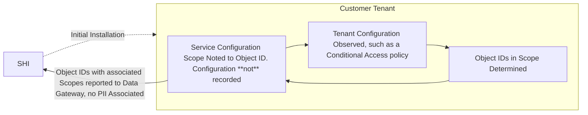

# Prerequisites

Before deploying SHIELD or using Discover, ensure your environment meets all license, configuration, permission, and software requirements.

---

# Pricing

## Azure Cost Estimate Associated (as of 7/28/2026):

| Premium v4 Service Plan | vCPU(s) | RAM | Storage | Pay as you go | 1 year savings plan | 3 year savings plan | 1 year reserved | 3 year reserved |
|-----------------|-------------------|---------------------|-----------------|-------------------|---------------------|-----------------|-------------------|---------------------|
| P0v4 | 1 | 4 GB | 250 GB | **$53.29**/month | **$36.771**/month ~ 31% savings | **$24.514**/month ~ 54% savings | **$31.420**/month ~ 41% savings | **$20.251**/month ~ 62% savings |
| P1v4 | 2 | 8 GB | 250 GB | **$106.58**/month | **$73.541**/month ~ 31% savings | **$49.027**/month ~ 54% savings | **$62.919**/month ~ 41% savings | **$40.501**/month ~ 62% savings |

---

# Network Traffic Inspection

Network traffic inspection must be turned off on the device where SHIELD is being installed. This ensures the installation process proceeds without interruption and prevents any disruption to the application’s functionality. To disable network traffic inspection, reach out to your networking team, security team, or the person in charge of information technology at your organization. Each organization manages its own inspection tools and policies, and there is no universal method.

---

## SHIELD Core Platform Requirements

SHIELD automates secure deployment and lifecycle management using Microsoft 365 and Azure. It requires specific license levels, identity configurations, and Microsoft Defender components.

### Environment Requirements

- ✅ Deploying user must have **Global Admin Rights**  
- ✅ Microsoft Defender for Endpoint must be provisioned. See [Defend Usage Guide](../Defend/Usage-Guide/), under **Defender for Endpoint Workspace Creation**
- ✅ [Security Defaults](https://learn.microsoft.com/en-us/azure/active-directory/fundamentals/concept-fundamentals-security-defaults#disabling-security-defaults) must be disabled in Entra ID  
- ✅ [Certificate Authentication](https://learn.microsoft.com/en-us/azure/active-directory/authentication/how-to-certificate-based-authentication#step-2-enable-cba-on-the-tenant) must be disabled for SHIELD's security groups

---

## Data Security

### SHI Lab Azure Architecture

- Regulatory compliance standards: [https://servicetrust.microsoft.com/](https://servicetrust.microsoft.com/){:target="_blank"}
- Encryption at rest (mandatory)
- Encryption in transit (mandatory)
    - Quantum resistant algorithms only
    - Latest TLS version for resource only
- CRUD Audit
    - SQL Audit is enabled too
- Access Audit (Mandatory)
- Full micro-segmentation (address/port enforcement for all resources)
- Data-store behind API, no internet access
- SSO Access Only (no cred vaulting workarounds, pure modern SSO, credential-less only)
- MFA for all authentication is mandatory
- Human-free production-only design
    - Access to the Production environment is limited to only highly critical incidents.
- Debug access is severely limited
- No Operating Systems
    - Pure Serverless
    - Always up to date
    - No custom execution except for designed workload (no viruses possible)
    - No update downtime
    - Vulnerability patching done before public announcement of vulnerability
    - Self-healing

### Miscellaneous Considerations

- No customer data is used in any environment except for production
- Environment is only production only, reducing surface area of attack
    - No dev or test environments
    - Prod only via ring deployment and feature flags
- All tooling can run locally so that no production access is required for testing, development and debugging
- No on-premise systems, all resources are cloud only including end user compute/systems
- Hardware supply chain is strictly enforced
- Surface devices are only allowed at all levels of end user compute
- Firmware credentials are set to cert auth on all endpoints
- Device source code available for review: [https://microsoft.github.io/mu/](https://microsoft.github.io/mu/){:target="_blank"}

---

## Data Structure

### High-level Data Flow Diagram

SHIELD: Discover does not collect Personally Identifiable Information (PII) or similar data – it is only focused on the scope of configurations within the Microsoft security stack, and not on any private employee or customer data. Specifics on what data collected is listed in the next section.
As a self-hosted application, data collected lives in the customer environment until it is anonymized and sent to SHIELD's database via the Data Gateway. The Data Gateway structure is available to review upon request.

### Example Data Structure & Output

SHIELD Discover collects the following data:

- Tenant ID
- Principal ID that saved the report
- Principal ID that ran the report
- Principle Object ID
    - Assigned License – The Service Plan IDs of the license(s) that are assigned (direct or indirect) to the specific principal
    - Assigned Services – The service configuration assignment determining 'benefitting' from a service. This includes the service configuration type if possible (feature, such as 'Conditional Access,' a service within the Entra ID license)
    - Consumed Services – Usage telemetry retrieved to indicate if the specific principal is consuming/using the service, regardless of license status

For a complete look at the Data Structure, please refer to the [Data Gateway API Spec](https://specs.shilab.com/){:target="_blank"}.

---

### Licensing Requirements by Mode

SHIELD uses `M3` and `M5` to refer to Microsoft 365 license families, abstracting E3/E5 and similar plans.

| Mode | License | Additional Requirements |
|------|---------|--------------------------|
| **ESM** (Enterprise Security Mode) | M3 or equivalent | Devices must be Hybrid or Cloud Joined |
| **SSM** (Specialized Security Mode) | M5 or equivalent | Devices must be Hybrid or Cloud Joined |
| **PSM** (Privileged Security Mode) | M5 or equivalent | Devices must be Autopilot-registered and [Secure Core Certified](../Defend/Reference/Hardware-Selection) |

---

## Discover System Requirements

Discover is a component of SHIELD that audits licensing configuration, queries Microsoft APIs, and stores analysis in SHI - Data Gateway. The following setup is required.

- Discover requires no Microsoft Licensing to operate.
- Discover requires the same dependencies (minus licenses) as SHIELD's core system.

---

### Entra ID Role Permissions

Discover uses read-only Entra ID roles for configuration queries. These permissions are scoped with the principle of least privilege.

| Role | Required For |
|------|---------------|
| **Global Reader** | Basic environment access (Defender, Entra ID) |
| **Security Administrator** | Access to Defender for Endpoint & Identity APIs |
| **User Administrator** | Access to user directory properties |

**Related plugin guides:**
docs\SHIELD\Reference\Plugins\DefenderEndpoint

- 📄 [Defender for Endpoint](../Discover/Plugins/DefenderEndpoint)  
- 📄 [Defender for Identity](../Discover/Plugins/DefenderIdentity)  
- 📄 [Entra ID](../Discover/Plugins/EntraID)

!!! info "Permissions Note"
    Discover will never modify your configuration. All operations are read-only and scoped to data retrieval.

---

## Related Pages

- 📄 [Hardware Requirements](../Defend/Reference/Hardware-Selection)  
- 📄 [Deployment Guide](../Getting-Started)  
