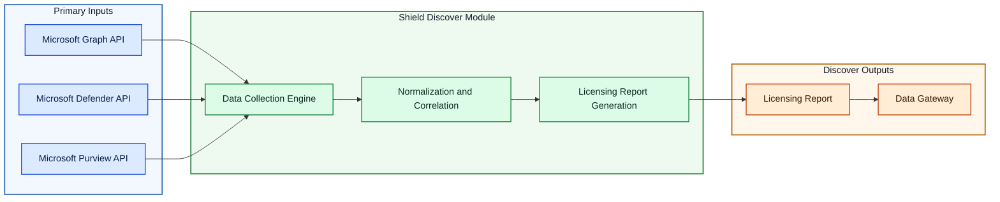
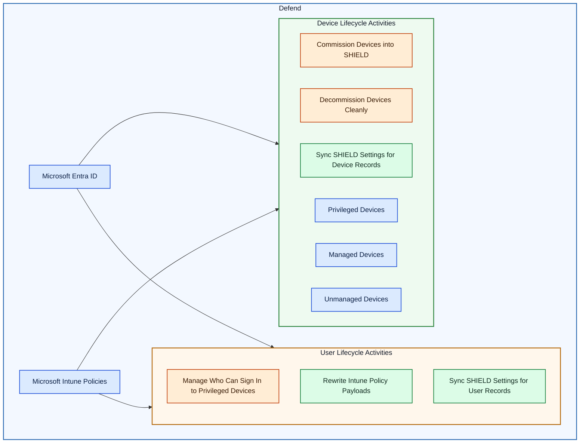
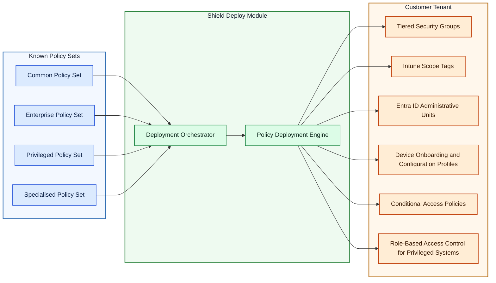

# SHI Environment Lockdown & Defense

## Overview

SHIELD is a hybrid SaaS solution with a customer-installed app in their Azure tenant. The Shield app service is an orchestration tool that simplifies the deployment, management, and maintenance of Microsoft's Secure Privileged Access architecture. With SHIELD, you can automate the deployment of complex security infrastructures, device management, and user management while adhering to security best practices. SHIELD helps organizations to reduce the time and expertise required for deployment from a year or more to just a few minutes. 

SHI operates a centralized SaaS service in its own Azure tenant known as the Data Gateway. This is a SaaS component shared by multiple customers using tenant isolation via access token claims cryptographically signed by Microsoft EntraID. It provides storage, analysis, and reporting services for Shield data. The SHIELD app service collects and processes data within the customer tenant before providing abstracted & fully anonymized data results back to the Data Gateway for reporting and analysis. 

!!! info "Security Considerations"
    SHI does not manage or access the SHIELD app service runtime. Where authorized by the customer, the Shield app service may initiate configuration changes in the customer's tenant using delegated or application permissions explicitly consented to by the customer.  All requirements can be set up by the delivery team or customer prior to engagement. Note that these configuration changes are deployed as security policies which will need further customer action to associate them with users. 

## Architecture Topology

The following diagram shows the high-level SHIELD deployment and trust boundaries between the customer tenant, SHI's SaaS tenant, and Microsoft Entra ID. Shield components that are deployed to customer environments are outlined in red.  

![This diagram illustrates a multi-tenant Microsoft Azure topology showing a vendor (Shi) tenant and a customer tenant within the Microsoft Azure Global boundary. Key components: the Shi tenant contains a Data Gateway and ShiLab.com; Microsoft EntraID is shown as the identity service bridging or present in the environment; the Customer Tenant contains a Shield Resource Group which houses SHIELD, auxiliary components (Shield VNet, PS Proxy service, Key Vault, network interfaces, DNS zones) and customer resources. The relationships indicate the logical grouping of resources by tenant and resource group and highlight where identity and gateway components reside relative to the customer SHIELD deployment.](../assets/images/Overview/Overview.png)

## Audience

This documentation is primarily intended for technical users who are responsible for the deployment, management, and maintenance of security infrastructures. However, the documentation is designed to be accessible to non-technical users as well.

## Key Features and Benefits

SHIELD comes with a range of features that simplify the deployment and management of complex security infrastructures. Some of the key features and benefits of SHIELD are:

- Automate the deployment of complex security infrastructures
- Manage devices, users, intermediaries, and server/interfaces with ease
- Adhere to security best practices
- Reduce maintenance efforts

## SHIELD in the Security Landscape

SHIELD is an orchestration tool in the larger security landscape. It does not bring new security functionality, but instead automates the tools that already exist. SHIELD operates as an orchestrator for the rest of the security landscape, simplifying the deployment and management of complex security infrastructures.

## Prerequisites

Check out this page for more details: [Getting Started - Prerequisites](Prerequisites/index.md)

## Installation

The Shield installer ('Shield Desktop') is downloaded to the customer tenant and executed by an administrator. During installation, the administrator is required to authenticate interactively to the customers' Azure tenant. The installer uses this authenticated session to provision an Azure App Service and associated resources directly into the tenant under the customers' ownership and governance. No resources are deployed without explicit customer action and consent, and the resulting App Service operates entirely within the customers' Azure subscription. 
The installer provisions the Shield UI web application and associated components to the customer's tenant.

## Shield Module Overview

Depending on licensing, the following components will be available from the UI:

[Shield Discover](https://docs.shilab.com/SHIELD/Discover/) The Discover module enables advanced licensing intelligence and compliance reporting for Microsoft 365 services

[Shield Defend](https://docs.shilab.com/SHIELD/Defend/)  The Defend module is responsible for all lifecycle operations within the SHIELD platform. It provides user and device onboarding, offboarding, access enforcement, and enforcement of privileged workflows in alignment with the SPA model deployed by the Deploy module.

Click this link to see more on [Secure Privileged Access](https://learn.microsoft.com/en-us/security/privileged-access-workstations/overview)

[Shield Deploy](https://docs.shilab.com/SHIELD/Deploy/)  SHIELD's Deploy module provides the foundation for a secure environment using Microsoft's Securing Privileged Access (SPA) architecture. This module automates the provisioning of security-critical components such as identity boundaries, privileged access zones, Conditional Access policies, and more. 

## Recommended Environment

While not mandatory, it is highly recommended to use SHIELD in the following environment:

- An `Azure Subscription` for hosting the application, as it is a security best practice to run the app in Azure
- All objects to be managed by SHIELD (devices, users, apps, etc.) synced/connected to Entra ID, the primary identity provider used by SHIELD

By following these recommendations, you can speed up the adoption process for SHIELD.

## Summary

In the rest of the documentation, we will provide detailed instructions on how to install, configure, and use SHIELD to achieve these benefits.

## See Also

- [Usage Guides](Usage-Guide.md)
- Change Log - Coming Soon!
- [SHIELD Architecture](Reference/Architecture/index.md)
- [API Documentation](Reference/Development/OpenAPI.md)
- [Troubleshooting](Deploy/Troubleshooting.md)
- [Contact Us](https://shilab.com/contact)
